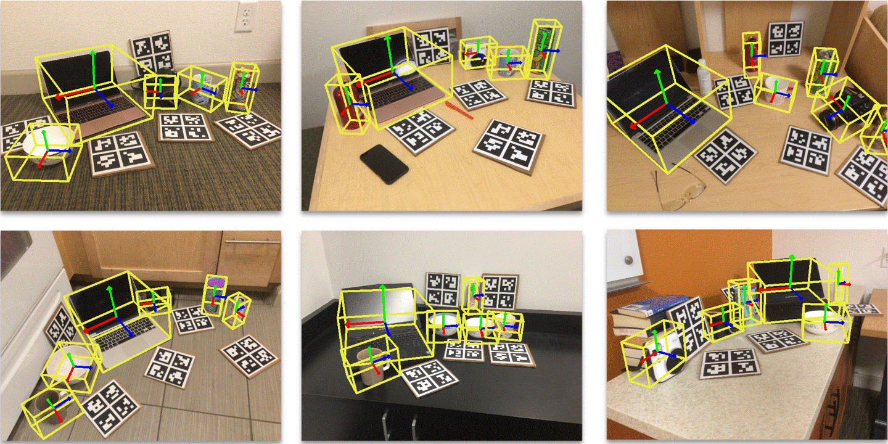
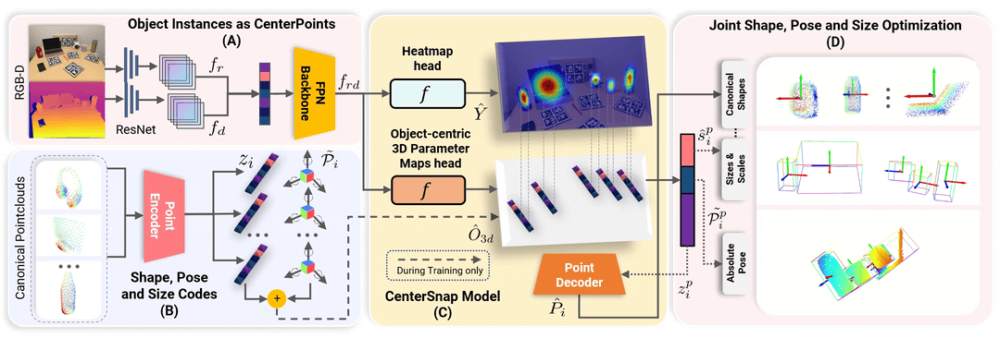

# CenterSnap: Single-Shot Multi-Object 3D Shape Reconstruction and Categorical 6D Pose and Size Estimation
[](https://opensource.org/licenses/MIT) [](https://paperswithcode.com/sota/6d-pose-estimation-using-rgbd-on-camera25?p=centersnap-single-shot-multi-object-3d-shape)

This repository is the pytorch implementation of our paper:
<a href="https://www.tri.global/" target="_blank">
 
</a>

**CenterSnap: Single-Shot Multi-Object 3D Shape Reconstruction and Categorical 6D Pose and Size Estimation**<br>
[__***Muhammad Zubair Irshad***__](https://zubairirshad.com), [Thomas Kollar](http://www.tkollar.com/site/), [Michael Laskey](https://www.linkedin.com/in/michael-laskey-4b087ba2/), [Kevin Stone](https://www.linkedin.com/in/kevin-stone-51171270/), [Zsolt Kira](https://faculty.cc.gatech.edu/~zk15/) <br>
International Conference on Robotics and Automation (ICRA), 2022<br>

[[Project Page](https://zubair-irshad.github.io/projects/CenterSnap.html)] [[arXiv](https://arxiv.org/abs/2203.01929)] [[PDF](https://arxiv.org/pdf/2203.01929.pdf)] [[Video](https://www.youtube.com/watch?v=Bg5vi6DSMdM)] [[Poster](https://zubair-irshad.github.io/projects/resources/Poster%7CCenterSnap%7CICRA2022.pdf)] 

[](https://colab.research.google.com/github/zubair-irshad/CenterSnap/blob/master/notebook/explore_CenterSnap.ipynb)<br>

Follow-up ECCV'22 work:

**ShAPO: Implicit Representations for Multi-Object Shape, Appearance and Pose Optimization**<br>
[__***Muhammad Zubair Irshad***__](https://zubairirshad.com), [Sergey Zakharov](https://zakharos.github.io/), [Rares Ambrus](https://www.tri.global/about-us/dr-rares-ambrus), [Thomas Kollar](http://www.tkollar.com/site/), [Zsolt Kira](https://faculty.cc.gatech.edu/~zk15/), [Adrien Gaidon](https://adriengaidon.com/) <br>
European Conference on Computer Vision (ECCV), 2022<br>

[[Project Page](https://zubair-irshad.github.io/projects/ShAPO.html)] [[arXiv](https://arxiv.org/abs/2207.13691)] [[PDF](https://arxiv.org/pdf/2207.13691.pdf)] [[Video](https://youtu.be/LMg7NDcLDcA)] [[Poster](https://zubair-irshad.github.io/projects/resources/Poster%7CCenterSnap%7CICRA2022.pdf)] 


<p align="center">

</p>


<p align="center">

</p>

## Citation

If you find this repository useful, please consider citing:

```
@inproceedings{irshad2022centersnap,
  title={CenterSnap: Single-Shot Multi-Object 3D Shape Reconstruction and Categorical 6D Pose and Size Estimation},
  author={Muhammad Zubair Irshad and Thomas Kollar and Michael Laskey and Kevin Stone and Zsolt Kira},
  journal={IEEE International Conference on Robotics and Automation (ICRA)},
  year={2022},
  url={https://arxiv.org/abs/2203.01929},
}

@inproceedings{irshad2022shapo,
  title={ShAPO: Implicit Representations for Multi-Object Shape Appearance and Pose Optimization},
  author={Muhammad Zubair Irshad and Sergey Zakharov and Rares Ambrus and Thomas Kollar and Zsolt Kira and Adrien Gaidon},
  journal={European Conference on Computer Vision (ECCV)},
  year={2022},
  url={https://arxiv.org/abs/2207.13691},
}
```


### Contents
 - [💻 Environment](#-environment)
 - [📊 Dataset (**Updated**)](#-dataset)
 - [✨ Training and Inference](#-training-and-inference)
 - [📝 FAQ (**Updated**)](#-faq)
 - [🙌 Follow-up works (**Updated**)](#follow-up-works)
 

## 💻 Environment

Create a python 3.8 virtual environment and install requirements:

```bash
cd $CenterSnap_Repo
conda create -y --prefix ./env python=3.8
conda activate ./env/
./env/bin/python -m pip install --upgrade pip
./env/bin/python -m pip install -r requirements.txt -f https://download.pytorch.org/whl/torch_stable.html
```
The code was built and tested on **cuda 10.2**

## 📊 Dataset

**New Update**: Please checkout the distributed script of our new ECCV'22 work [**ShAPO**](https://github.com/zubair-irshad/shapo#-dataset) if you'd like to collect your own data from scratch in a couple of hours. That distributed script collects the data in the same format as required by **CenterSnap**, although with a few minor modications as mentioned in that [repo](https://github.com/zubair-irshad/shapo#-dataset). 

1. Download pre-processed dataset

We recommend downloading the preprocessed dataset to train and evaluate CenterSnap model. Download and untar [Synthetic](https://tri-robotics-public.s3.amazonaws.com/centersnap/CAMERA.tar.gz) (868GB) and [Real](https://tri-robotics-public.s3.amazonaws.com/centersnap/Real.tar.gz) (70GB) datasets. These files contains all the training and validation you need to replicate our results.

```
cd $CenterSnap_REPO/data
wget https://tri-robotics-public.s3.amazonaws.com/centersnap/CAMERA.tar.gz
tar -xzvf CAMERA.tar.gz

wget https://tri-robotics-public.s3.amazonaws.com/centersnap/Real.tar.gz
tar -xzvf Real.tar.gz
```

The data directory structure should follow:

```
data
├── CAMERA
│   ├── train
│   └── val_subset
├── Real
│   ├── train
└── └── test
```

2. To prepare your own dataset, we provide additional scripts under [prepare_data](https://github.com/zubair-irshad/CenterSnap/tree/master/prepare_data).

## ✨ Training and Inference

1. Train on NOCS Synthetic (requires 13GB GPU memory):
```bash
./runner.sh net_train.py @configs/net_config.txt
```

Note than *runner.sh* is equivalent to using *python* to run the script. Additionally it sets up the PYTHONPATH and CenterSnap Enviornment Path automatically. 

2. Finetune on NOCS Real Train (Note that good results can be obtained after finetuning on the Real train set for only a few epochs i.e. 1-5):
```bash
./runner.sh net_train.py @configs/net_config_real_resume.txt --checkpoint \path\to\best\checkpoint
```
 
3. Inference on a NOCS Real Test Subset

<p align="center">

</p>

Download a small NOCS Real subset from [[here](https://www.dropbox.com/s/yfenvre5fhx3oda/nocs_test_subset.tar.gz?dl=1)]

```bash
./runner.sh inference/inference_real.py @configs/net_config.txt --data_dir path_to_nocs_test_subset --checkpoint checkpoint_path_here
```

You should see the **visualizations** saved in ```results/CenterSnap```. Change the --ouput_path in *config.txt to save them to a different folder

4. Optional (Shape Auto-Encoder Pre-training)

We provide pretrained model for shape auto-encoder to be used for data collection and inference. Although our codebase doesn't require separately training the shape auto-encoder, if you would like to do so, we provide additional scripts under **external/shape_pretraining**


## 📝 FAQ

**1.** I am not getting good performance on my custom camera images i.e. Realsense, OAK-D or others.
 
- Ans: Since the network was finetuned on the [real-world NOCS data](https://github.com/zubair-irshad/CenterSnap/edit/master/README.md#-training-and-inference) only, currently the pre-trained network gives good 3D prediction for the the following [camera setting](https://github.com/zubair-irshad/CenterSnap/blob/master/simnet/lib/camera.py#L33-L55). To get good prediction on your own camera parameters, make sure to [finetune the network](https://github.com/zubair-irshad/CenterSnap/edit/master/README.md#-training-and-inference) with your own small subset after [pre-training on the synthetic dataset](https://github.com/zubair-irshad/CenterSnap/edit/master/README.md#-training-and-inference). We provide data preparation scripts [here](https://github.com/zubair-irshad/CenterSnap/tree/master/prepare_data).

**2.** How to generate good zero-shot results on HSR robot camera:

 - Ans: Please see **the answer to FAQ1 above** for best results. An alternate solution that we employed to do a [quick demo on HSR robot](https://zubair-irshad.github.io/projects/ShAPO.html) is to warp the rgb-d observarions coming out of HSR robot camera or any other custom camera such that they match the intrinsics of the NOCS real camera (which we finetune our model on). This way one can get decent results with only finetuning on NOCS real dataset. Please see [this answer](https://github.com/zubair-irshad/shapo/issues/17#issuecomment-1620592107) and the corresponding [gist here](https://gist.github.com/zubair-irshad/a6ddbef3b4112a259b463794502f8f27) for the code.


**3.** I am getting ```no cuda GPUs available``` while running colab. 

- Ans: Make sure to follow this instruction to activate GPUs in colab:

```
Make sure that you have enabled the GPU under Runtime-> Change runtime type!
```

**4.** I am getting ```raise RuntimeError('received %d items of ancdata' %
RuntimeError: received 0 items of ancdata``` 

- Ans: Increase ulimit to 2048 or 8096 via ```uimit -n 2048```

**5.** I am getting ``` RuntimeError: CUDA error: no kernel image is available for execution on the device``` or ``` You requested GPUs: [0] But your machine only has: [] ``` 

- Ans: Check your pytorch installation with your cuda installation. Try the following:


1. Installing cuda 10.2 and running the same script in requirements.txt

2. Installing the relevant pytorch cuda version i.e. changing this line in the requirements.txt

```
torch==1.7.1
torchvision==0.8.2
```

**6.** I am seeing zero val metrics in ***wandb***
- Ans: Make sure you threshold the metrics. Since pytorch lightning's first validation check metric is high, it seems like all other metrics are zero. Please threshold manually to remove the outlier metric in wandb to see actual metrics.   

## Follow-up-works
* Our follow-up ECCV work: 
    * [ShAPO: Implicit Representations for Multi Object Shape Appearance and Pose Optimization, ECCV, 2022](https://zubair-irshad.github.io/projects/ShAPO.html)

* Other follow-up works (Shout-out to the authors for great work):
    * Articulated Objects: [CARTO: Category and Joint Agnostic Reconstruction of ARTiculated Objects, CVPR, 2023](http://carto.cs.uni-freiburg.de/)
    * Grasping: [Real-time Simultaneous Multi-Object 3D Shape Reconstruction, 6DoF Pose Estimation and Dense Grasp Prediction](https://arxiv.org/abs/2305.09510)
    * More Grasping + real-world experiments: [CenterGrasp: Object-Aware Implicit Representation Learning for Simultaneous Shape Reconstruction and 6-DoF Grasp Estimation](https://arxiv.org/pdf/2312.08240.pdf) 

## Acknowledgments
* This code is built upon the implementation from [SimNet](https://github.com/ToyotaResearchInstitute/simnet)

## Licenses
* The source code is released under the [MIT license](https://opensource.org/licenses/MIT).
