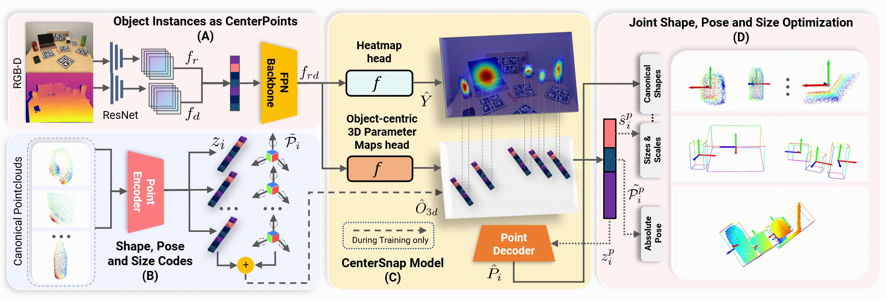

# CenterSnap: Single-Shot Multi-Object 3D Shape Reconstruction and Categorical 6D Pose and Size Estimation
 [](https://opensource.org/licenses/MIT) [](https://paperswithcode.com/sota/6d-pose-estimation-using-rgbd-on-camera25?p=centersnap-single-shot-multi-object-3d-shape)
[](https://paperswithcode.com/sota/6d-pose-estimation-using-rgbd-on-real275?p=centersnap-single-shot-multi-object-3d-shape)

This repository is the pytorch implementation of our paper:
<a href="https://www.tri.global/" target="_blank">
 
</a>

**CenterSnap: Single-Shot Multi-Object 3D Shape Reconstruction and Categorical 6D Pose and Size Estimation**<br>
[__***Muhammad Zubair Irshad***__](https://zubairirshad.com), [Thomas Kollar](http://www.tkollar.com/site/), [Michael Laskey](https://www.linkedin.com/in/michael-laskey-4b087ba2/), [Kevin Stone](https://www.linkedin.com/in/kevin-stone-51171270/), [Zsolt Kira](https://faculty.cc.gatech.edu/~zk15/) <br>
International Conference on Robotics and Automation (ICRA), 2022<br>

[[Project Page](https://zubair-irshad.github.io/projects/CenterSnap.html)] [[arXiv](https://arxiv.org/abs/2203.01929)] [[PDF](https://arxiv.org/pdf/2203.01929.pdf)] [[Video](https://www.youtube.com/watch?v=Bg5vi6DSMdM)] [[GitHub](https://github.com/zubair-irshad/CenterSnap)] 

[](https://colab.research.google.com/github/zubair-irshad/CenterSnap/blob/pre_public/notebook/explore_CenterSnap.ipynb)<br>

<p align="center">

</p>

<p align="center">

</p>

## Environment

Create a python 3.8 virtual environment and install requirements:

```bash
cd $CenterSnap_Repo
conda create -y --prefix ./env python=3.8
conda activate ./env/
./env/bin/python -m pip install --upgrade pip
./env/bin/python -m pip install -r requirements.txt -f https://download.pytorch.org/whl/torch_stable.html
```
The code was built and tested on **cuda 10.1**

## Datasets

Coming soon!

## Train and Validate

Train on NOCS Synthetic (requires 13GB GPU memory):
```bash
./runner.sh net_train.py @configs/net_config.txt
```

Finetune on NOCS Real Train (Note that good results can be obtained after finetuning on the Real train set for only a few epochs i.e. 1-5):
```bash
./runner.sh net_train.py @configs/net_config_real_resume.txt --checkpoint \path\to\best\checkpoint
```
 
Inference on a NOCS Real Test Subset

Download a small NOCS Real subset from [[here](https://www.dropbox.com/s/yfenvre5fhx3oda/nocs_test_subset.tar.gz?dl=1)]

```bash
./runner.sh inference/inference_real.py @configs/net_config.txt --data_dir path_to_nocs_test_subset --checkpoint checkpoint_path_here
```

You should see the **visualizations** saved in ```results/CenterSnap```. Change the --ouput_path in *config.txt to save them to a different folder

## FAQ

**1.** I am getting ```no cuda GPUs available``` while running colab. 

- Ans: Make sure to follow this instruction to activate GPUs in colab:

```
Make sure that you have enabled the GPU under Runtime-> Change runtime type!
```

**2.** I am getting ```raise RuntimeError('received %d items of ancdata' %
RuntimeError: received 0 items of ancdata``` 

- Ans: Increase ulimit to 2048 or 8096 via ```uimit -n 2048```

```
Make sure that you have enabled the GPU under Runtime-> Change runtime type!
```

**3.** I am getting ``` RuntimeError: CUDA error: no kernel image is available for execution on the device``` 

- Ans: Check your pytorch installation with your cuda installation. Try the following:


1. Installing cuda 10.1 and running the same script in requirements.txt

2. Installing the relevant pytorch cuda version i.e. changing this line in the requirements.txt

```
torch==1.7.1+cu101 -f https://download.pytorch.org/whl/torch_stable.html
torchvision==0.8.2+cu101 -f https://download.pytorch.org/whl/torch_stable.html 
```

## Citation

If you find this repository useful, please cite our paper:

```
@inproceedings{irshad2022centersnap,
  title={CenterSnap: Single-Shot Multi-Object 3D Shape Reconstruction and Categorical 6D Pose and Size Estimation},
  author={Muhammad Zubair Irshad and Thomas Kollar and Michael Laskey and Kevin Stone and Zsolt Kira},
  journal={IEEE International Conference on Robotics and Automation (ICRA)},
  year={2022},
  url={https://arxiv.org/abs/2203.01929},
}
```

## Acknowledgments
* This code is built upon the implementation from [SimNet](https://github.com/ToyotaResearchInstitute/simnet)

